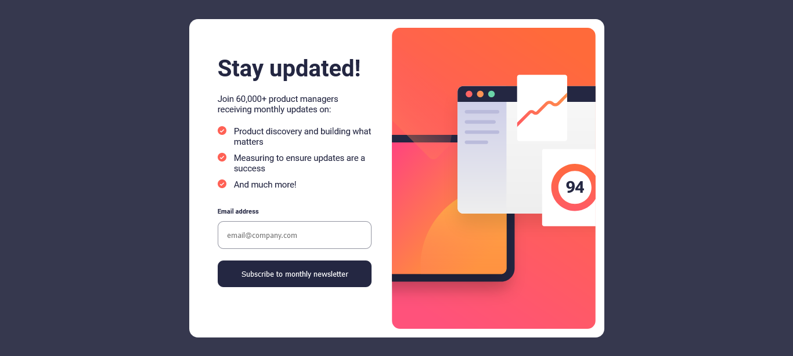

# Frontend Mentor - Newsletter sign-up form with success message solution

This is a solution to the [Newsletter sign-up form with success message challenge on Frontend Mentor](https://www.frontendmentor.io/challenges/newsletter-signup-form-with-success-message-3FC1AZbNrv). Frontend Mentor challenges help you improve your coding skills by building realistic projects. 

## Table of contents

- [Overview](#overview)
  - [The challenge](#the-challenge)
  - [Screenshot](#screenshot)
  - [Links](#links)
- [My process](#my-process)
  - [Built with](#built-with)
  - [What I learned](#what-i-learned)
  - [Continued development](#continued-development)
- [Author](#author)

## Overview

### The challenge

Users should be able to:

- Add their email and submit the form
- See a success message with their email after successfully submitting the form
- See form validation messages if:
  - The field is left empty
  - The email address is not formatted correctly
- View the optimal layout for the interface depending on their device's screen size
- See hover and focus states for all interactive elements on the page

### Screenshot

### Links

- Solution URL: [Add solution URL here](https://your-solution-url.com)
- Live Site URL: [Add live site URL here](https://your-live-site-url.com)

## My process

### Built with

- Semantic HTML5 markup
- CSS custom properties
- Flexbox
- Mobile-first workflow
- Responsive web design

### What I learned

This was a very nice challenge where I had to link DOM manipulation with displaying of different sections - while keeping in mind the fact that things varied totally in different screen sizes. I faced a lot of mini challenges especially in desgn part - which were very rewarding after I figured out the solution.

### Continued development

I thought of using CSS Grid here but again ended up using flexbox. Probably I will try this with grid after a while - and I am thinking of applying some cool CSS effects, which I never tried my hands on.

## Author

- GitHub - [@kaiser-sb](https://github.com/kaiser-sb)
- Frontend Mentor - [@kaiser-sb](https://www.frontendmentor.io/profile/kaiser-sb)
- LinkedIn - [Sunetra Bhowmick](https://www.linkedin.com/in/kaiser-sb/)

